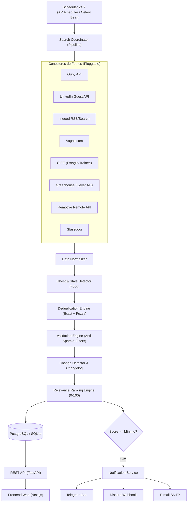

# Argos Job Hunter 2.0 🚀
### Agente Autônomo 24/7 para Busca, Validação, Deduplicação e Monitoramento de Oportunidades Profissionais

O **Argos Job Hunter** é um sistema completo e autônomo projetado para rastrear a internet 24 horas por dia, 7 dias por semana em busca de vagas de emprego, estágios, trainees e oportunidades semelhantes em múltiplas fontes simultâneas.

O agente elimina o trabalho manual e repetitivo de monitorar dezenas de sites de vagas, garantindo **máxima cobertura**, **zero repetição de vagas**, **descarte de anúncios fantasmas** e **alertas instantâneos** por Telegram, Discord e E-mail.

---

## 🎯 Destaques do Sistema

* **Busca Contínua 24/7**: Scheduler resiliente que roda em ciclos configuráveis (a cada 5min, 15min, 30min, 1h) sem travar caso fontes individuais falhem.
* **Múltiplas Fontes Plug & Play**:
  - **Gupy**: Integração direta com Portal API pública (`portal.gupy.io/api/v1/jobs`) com paginação e normalização de tipo e modelo.
  - **LinkedIn**: Conector via endpoint público guest search (`seeMoreJobPostings`) com BeautifulSoup e rotação de headers.
  - **Indeed**: RSS descontinuado + busca com bloqueio anti-bot; usa fallback via browser renderizado (CloakBrowser) quando `CLOAK_ENABLED=true`.
  - **Vagas.com**: Extrator HTML com paginação, filtros de cidade e tipo de contratação.
  - **CIEE**: Conector especializado em estágios, trainees e jovem aprendiz.
  - **Greenhouse & Lever**: Conectores ATS de páginas de carreira diretas de empresas globais e tech.
  - **Remotive**: API pública de oportunidades de tecnologia 100% remotas.
  - **Glassdoor**: Conector com proteção de circuit breaker contra rate-limits.
  - **Mock**: Gerador determinístico de oportunidades para testes e validação offline.
* **Deduplicação Robusta em Múltiplas Camadas**:
  - Limpeza de URLs (eliminação de UTMs, tracking IDs, query params e âncoras).
  - Normalização de entidades jurídicas (elimina LTDA, S/A, ME, Inc, Corp, Brasil).
  - Stemming e sinonimização de cargos (ex: *"Estágio em Desenvolvimento"*, *"Estágio Desenvolvedor"* e *"Estagiário de Desenvolvimento"* são unificados como a mesma oportunidade).
  - Algoritmo de Similaridade Fuzzy (Rapidfuzz Token Sort Ratio $\ge 88\%$).
  - Associação cross-portal: quando uma vaga é encontrada em múltiplos portais, associa as URLs alternativas sem duplicar registros nem reenviar notificações.
* **Eliminação de Vagas Fantasmas ou Antigas**:
  - Descarte rigoroso de vagas publicadas há mais de 60 dias (`MAX_JOB_AGE_DAYS=60`).
  - NUNCA inventa datas: quando a data for indeterminada, registra explicitamente como `unknown_date`.
  - Detector de encerramento: varredura de sinais textuais como *"vaga encerrada"*, *"inscrições encerradas"*, *"processo seletivo finalizado"*.
  - Opcional: verificação HTTP HEAD/GET de links ativos.
* **Validação Estrita e Anti-Spam**:
  - Heurísticas anti-fraude (esquemas de dinheiro fácil, taxas de inscrição, marketing multinível).
  - Auditoria de descarte: cada vaga rejeitada gera log com motivo (`missing_company`, `spam`, `excluded_keyword`, `missing_mandatory_keyword`, etc.).
* **Relevance Ranking Explicável (0 a 100)**:
  - Pontuação ponderada: Cargo (25%), Skills/Palavras-chave (30%), Senioridade (15%), Localização (10%), Salário (10%), Recência (10%).
  - Justificativa transparente em lista de tópicos (*"Por que essa vaga combina"*).
* **Detecção de Alterações (Changelog)**:
  - Histórico de mudanças entre versões da mesma oportunidade (salário, modelo remoto/presencial, descrição, reabertura).
* **Resiliência e Circuit Breakers**:
  - Padrão Circuit Breaker (`CLOSED`, `OPEN`, `HALF_OPEN`) por fonte para proteção contra bloqueios de IP e rate limits (HTTP 429/403/500).
* **Notificações Multi-canal**:
  - **Telegram Bot** com formatação detalhada.
  - **Discord Webhook** com Embeds ricos e cores dinâmicas por pontuação.
  - **E-mail SMTP** (envio imediato ou resumos periódicos).
  - **Dashboard Web** interativo em Next.js / React.

---

## 🏗️ Arquitetura do Sistema



---

## 📁 Estrutura de Pastas

```text
hermes/
├── backend/
│   ├── app/
│   │   ├── api/
│   │   │   └── routes/
│   │   │       ├── agent.py          # Status, start, pause, runs, métricas e circuit breakers
│   │   │       ├── jobs.py           # Listagem com filtros, detalhes e changelog
│   │   │       ├── preferences.py    # Configuração de filtros, palavras-chave e canais
│   │   │       ├── notifications.py  # Histórico e testes de disparo (Telegram/Discord)
│   │   │       ├── profile.py        # Gestão de currículo e perfil do candidato
│   │   │       └── users.py          # Gestão do usuário
│   │   ├── core/
│   │   │   ├── config.py             # Configurações com Pydantic Settings
│   │   │   ├── database.py           # Sessão SQLAlchemy (compatível com SQLite e Postgres)
│   │   │   └── logging.py            # Logs estruturados e eventos de auditoria
│   │   ├── models/
│   │   │   └── entities.py           # Modelos ORM (Job, JobChangelog, SearchRun, Preferences, etc.)
│   │   ├── providers/
│   │   │   ├── jobs/                 # Conectores modulares de vagas
│   │   │   │   ├── base.py           # Classe abstrata JobSource e dataclass NormalizedJob
│   │   │   │   ├── gupy.py           # Conector Gupy Portal API
│   │   │   │   ├── linkedin.py       # Conector LinkedIn Guest Jobs
│   │   │   │   ├── indeed.py         # Conector Indeed (desativado: RSS extinto + anti-bot; mantido p/ uso manual)
│   │   │   │   ├── remoteok.py       # Conector RemoteOK API pública (tech remota, sem chave)
│   │   │   │   ├── vagas.py          # Conector Vagas.com HTML
│   │   │   │   ├── ciee.py           # Conector CIEE (Estágio & Trainee)
│   │   │   │   ├── greenhouse_lever.py # Conector Greenhouse & Lever ATS
│   │   │   │   ├── glassdoor.py      # Conector Glassdoor
│   │   │   │   ├── remotive.py       # Conector Remotive API
│   │   │   │   ├── mock.py           # Provedor Mock para testes
│   │   │   │   └── factory.py        # Registro e carregamento dinâmico de provedores
│   │   │   ├── telegram/             # Cliente de notificações do Telegram Bot
│   │   │   ├── discord/              # Cliente de notificações Discord Webhook
│   │   │   └── email/                # Cliente de notificações SMTP
│   │   ├── schemas/                  # Pydantic Schemas de validação e API
│   │   ├── services/
│   │   │   ├── dedup.py              # Engine de Deduplicação (URL, Hashes, Fuzzy Token Sort)
│   │   │   ├── ghost_detector.py     # Detector de Vagas Fantasmas e Encerramento
│   │   │   ├── validation.py         # Engine de Validação, Anti-Spam e Filtros Mandatórios
│   │   │   ├── ranking.py            # Engine de Classificação de Relevância (0-100)
│   │   │   ├── change_detector.py    # Detector de Alterações e Versionamento
│   │   │   ├── circuit_breaker.py    # Controlador de Circuit Breaker por fonte
│   │   │   ├── scheduler.py          # Agendador 24/7 integrado (APScheduler)
│   │   │   ├── pipeline.py           # Coordenador mestre do ciclo de busca
│   │   │   └── notifications.py      # Despachante multi-canal de alertas
│   │   ├── workers/                  # Workers distribuídos Celery (opcional)
│   │   └── main.py                   # Ponto de entrada FastAPI com lifespan
│   ├── tests/                        # 38 testes automatizados (pytest)
│   ├── requirements.txt              # Dependências Python
│   └── Dockerfile
├── frontend/                         # Interface Web Dashboard em Next.js / Tailwind
├── scripts/
│   ├── run_local.sh                  # Execução instantânea local com SQLite e Scheduler
│   ├── run_docker.sh                 # Deploy completo via Docker Compose
│   └── run_tests.sh                  # Execução da suíte de testes
├── docker-compose.yml                # Orquestração de contêineres para produção
├── .env.example                      # Variáveis de ambiente comentadas
└── README.md
```

---

## ⚡ Como Executar

### Opção 1: Execução Local Rápida (Zero Docker, SQLite Embutido)

Ideal para desenvolvimento e testes rápidos:

```bash
# 1. Clone ou entre no diretório
cd hermes

# 2. Crie e configure o arquivo de ambiente
cp .env.example .env

# 3. Execute o script de inicialização local
./scripts/run_local.sh
```

Acesse:
* **API Docs / Swagger**: [http://localhost:8000/docs](http://localhost:8000/docs)
* **Status do Agente**: [http://localhost:8000/api/agent/status](http://localhost:8000/api/agent/status)

---

### Opção 2: Produção 24/7 com Docker Compose

Para rodar continuamente com PostgreSQL, Redis, Celery, Backend e Frontend:

```bash
# 1. Configure as credenciais no .env (Telegram Bot Token, Discord Webhook, etc.)
cp .env.example .env

# 2. Inicie a stack de contêineres
./scripts/run_docker.sh
```

Serviços disponíveis:
* **Dashboard Web**: [http://localhost:3000](http://localhost:3000)
* **Backend API**: [http://localhost:8000/docs](http://localhost:8000/docs)

Para acompanhar os logs do agente em tempo real:
```bash
docker compose logs -f backend
```

---

## 🧪 Executando os Testes Automatizados

O sistema conta com **38 testes unitários e de integração** cobrindo:
* Deduplicação exata e variações de títulos com sinônimos (ex: *"Estágio em Desenvolvimento"* vs *"Estagiário de Desenvolvimento"*).
* Detecção de vagas fantasmas (>60 dias) e integridade de datas.
* Validação estrita, anti-spam, palavras mandatórias e proibidas.
* Algoritmo de ranking e justificativas explicáveis.
* Transições de estado do Circuit Breaker.
* Detecção de mudanças em salários e modelos de trabalho.

```bash
./scripts/run_tests.sh
```

---

## 📡 Formato Padrão de Notificação

Sempre que uma vaga ultrapassa o limite mínimo de relevância (`MINIMUM_MATCH_SCORE`), o agente despacha a notificação formatada:

```text
🎯 OPORTUNIDADE ENCONTRADA (Score: 94/100)

Título: Backend Developer Python / FastAPI
Empresa: Nubank
Área: Tecnologia / Desenvolvimento de Software
Localização: São Paulo, SP
Modelo: Remoto
Tipo: CLT
Data de publicação: 15/09/2026
Fonte: Gupy
Score de relevância: 94/100
Link: https://nubank.gupy.io/job/123456

💡 Motivos do match:
✓ Cargo exato 'Backend Developer' no título da vaga
✓ 4/4 skills encontradas: python, fastapi, postgresql, docker
✓ Senioridade 'mid' compatível com preferências
✓ Vaga 100% Remota
✓ Publicada nas últimas 24 horas
```

---

## 🛡️ Observabilidade e Métricas

Consulte métricas completas via `GET /api/agent/metrics`:
* Quantidade de páginas consultadas por fonte.
* Total de vagas encontradas vs válidas.
* Quantidade de duplicatas eliminadas.
* Discriminação de vagas descartadas por motivo (`discard_reasons`).
* Histórico de execuções com tempo decorrido e status (`completed`, `partial_error`).
* Estado live de cada Circuit Breaker (`CLOSED`, `OPEN`, `HALF_OPEN`).
